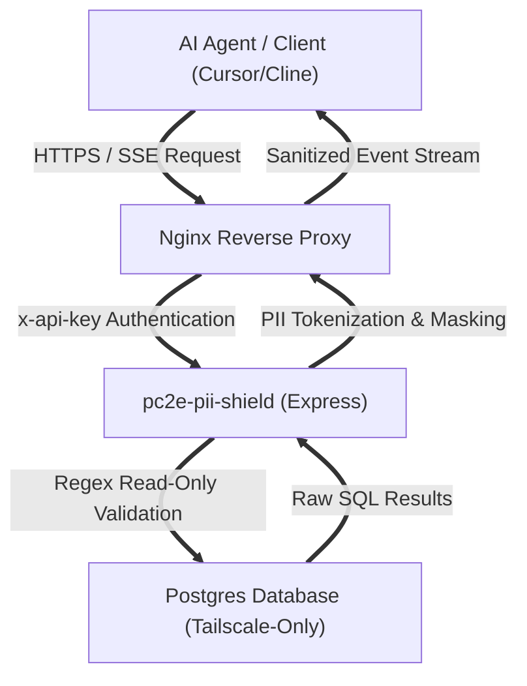

# pc2e-pii-shield

A secure, production-grade Model Context Protocol (MCP) server providing read-only PostgreSQL query execution with automatic, client-side, and edge Personally Identifiable Information (PII) masking. It allows LLM agents (e.g., Cursor, Cline, Claude Code) to execute SQL queries on databases while ensuring strict compliance with GDPR, PDPA, and data privacy principles.

Designed and engineered as a reusable security middleware product, this server intercepts database query results to prevent sensitive data egress.

---

## Technical Architecture



### Core Components

1.  **Auto-Masking Interceptor (`masking.ts`):** Dynamically scans SQL result sets. It utilizes a hybrid approach: column schema matching (e.g., fields containing `name`, `email`, `phone`) combined with regex-based content scanning to detect and mask sensitive identifiers before data leaves the server.
2.  **Pseudonymization Cache (`cache.ts`):** An in-memory, TTL-backed cache (default: 30 minutes) that maps raw values to temporary placeholders (e.g., `__PERSON_A__`, `__EMAIL_1__`). This allows bi-directional restoration while preventing unbounded memory consumption.
3.  **AST-Level Mutation Guard (`db.ts`):** A strict regex validator that intercepts raw SQL inputs. It blocks any non-SELECT commands and rejects queries containing forbidden keywords such as `DROP`, `ALTER`, `DELETE`, `TRUNCATE`, `CREATE`, or `GRANT`, ensuring a strict read-only boundary at the application layer.
4.  **Concurrent Session Manager (`index.ts`):** Unlike basic single-connection templates, this server maintains an active map of `SSEServerTransport` instances keyed by connection `sessionId`, allowing multiple remote developers or agents to connect and stream concurrently without state collisions.
5.  **Telemetry & Metrics Endpoint (`/stats`):** Exposes connection counts, unique client IP tracking, and aggregate query execution statistics to monitor installation and active usage in real-time.

---

## Security Model & Threat Mitigation

*   **Zero-Trust Database Connectivity:** Designed to prevent credential exposure. The database runs on an isolated Tailscale-only network interface (e.g., `100.92.174.76`), ensuring the database port is never exposed to the public internet.
*   **Encrypted Transport & API Key Security:** The server is fronted by Nginx over HTTPS (port 443) using wildcard SSL certificates, enforcing a secure API key authentication gate (`x-api-key`) before forwarding requests.
*   **In-Memory Lifecycle:** Pseudonymization mappings are stored in memory with strict TTLs, leaving no persistent disk footprints of the masked PII.

---

## Installation & Deployment

### 1. Prerequisite Environment Setup
Copy the environment template:
```bash
cp .env.example .env
```
Configure your database credentials and generate a secure API key inside `.env`.

### 2. Native Build
Ensure Node.js (v18+) is installed:
```bash
npm install
npm run build
npm start
```

### 3. Containerized Deployment
Deploy using Docker Compose:
```bash
docker compose up -d --build
```
This maps host port `3088` to the container's internal port `3000`, running the SSE server automatically.

---

## Remote Client Integration

### VS Code (Cline / Roo Code)
Add the SSE transport configuration to your settings JSON:
```json
{
  "mcpServers": {
    "pc2e-pii-shield": {
      "sseUrl": "https://pii-shield.thegeekybeng.com/sse?api_key=your_api_key_here"
    }
  }
}
```

### Cursor
Add a new MCP server in Cursor Settings under Features:
*   **Name:** `pc2e-pii-shield`
*   **Type:** `SSE`
*   **URL:** `https://pii-shield.thegeekybeng.com/sse?api_key=your_api_key_here`

---

## Project Context & Technical Lead

This project was architected, built, and open-sourced by **Andrew Yeo**.

### About the Lead Architect
Andrew is a Senior Systems Architect and AI Engineer based in Singapore, offering:
*   **25 years of professional experience** in APAC, managing program delivery, client onboarding, and technical vendor management.
*   **16+ years of systems architecture and technology leadership**, designing and deploying robust enterprise infrastructures and microservice platforms.
*   **2+ years of dedicated hands-on AI/ML engineering**, specializing in AI safety, LLM metrics, and secure agentic workflows.

### Verified Proof-of-Work
*   **Secure Civic Platforms:** Architected and deployed **MPS-Connect** (a civic constituency casework platform) and **Case-Writer-Intelligence (CWI)**, integrating a 3-stage causality engine with 7 human-in-the-loop approval gates, reducing document triage time by 40%.
*   **AI Metrology & Testing:** Designed the **Portable Continuous Context Engine (PC2E)**, running a systematic, empirical evaluation of 50,000 cases across six LLM providers to benchmark model alignment and compliance.
*   **Technical Focus:** Expert in **CI/CD & DevSecOps (GitHub Actions, Docker)**, containerized deployments, zero-trust network topologies, and local/edge SLM orchestrations.
